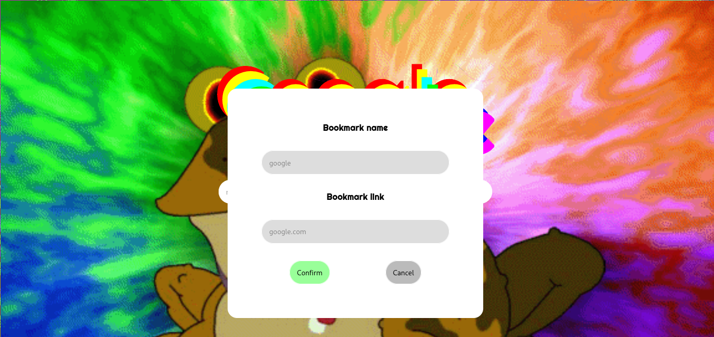

# newTabnewLife

Homepage for my web browsers

- `npm install` to install <em>node_modules</em>

- `npm start` to launch

Available through these links:
- <a href="https://chrome.google.com/webstore/detail/new-tab-new-life/ioddealhffmemabgpnchhplpkknbfemk?hl=it&authuser=0">Chrome</a>
- <a href="https://addons.mozilla.org/it/firefox/addon/newtabnewlife/?utm_source=addons.mozilla.org&utm_medium=referral&utm_content=search">Firefox</a>

<table>
  <tr> 
    <td>
    
    </td>
    <td>
  
    </td>
  </tr>
  

